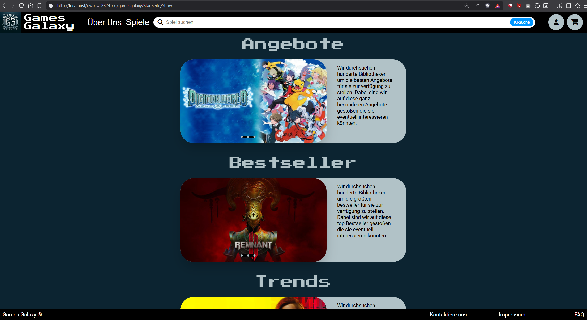
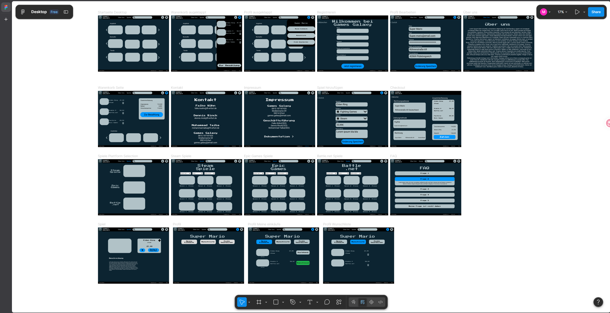
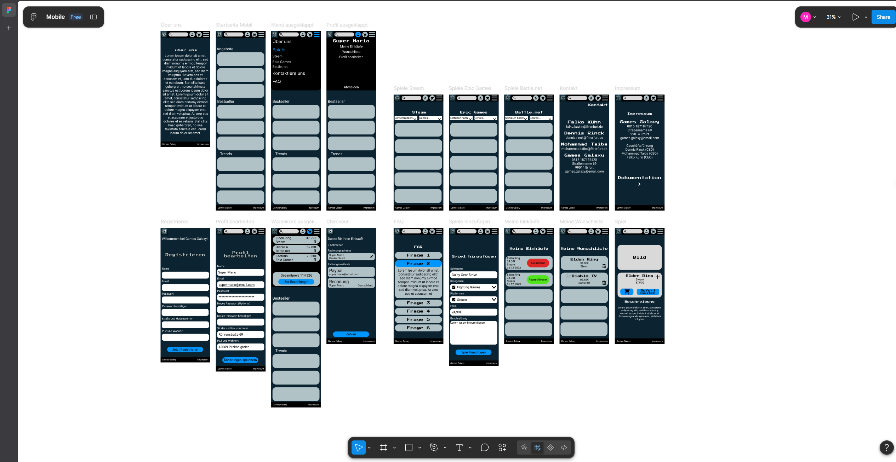
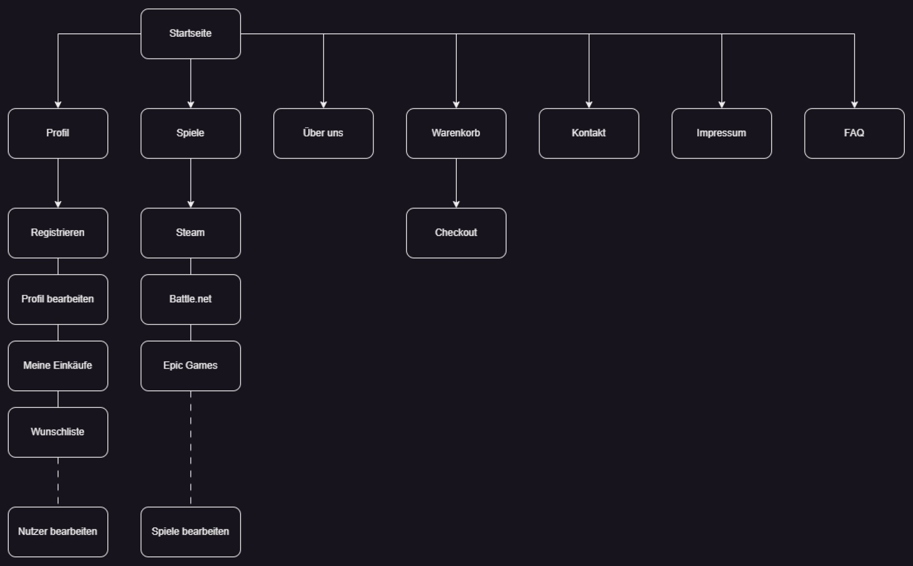
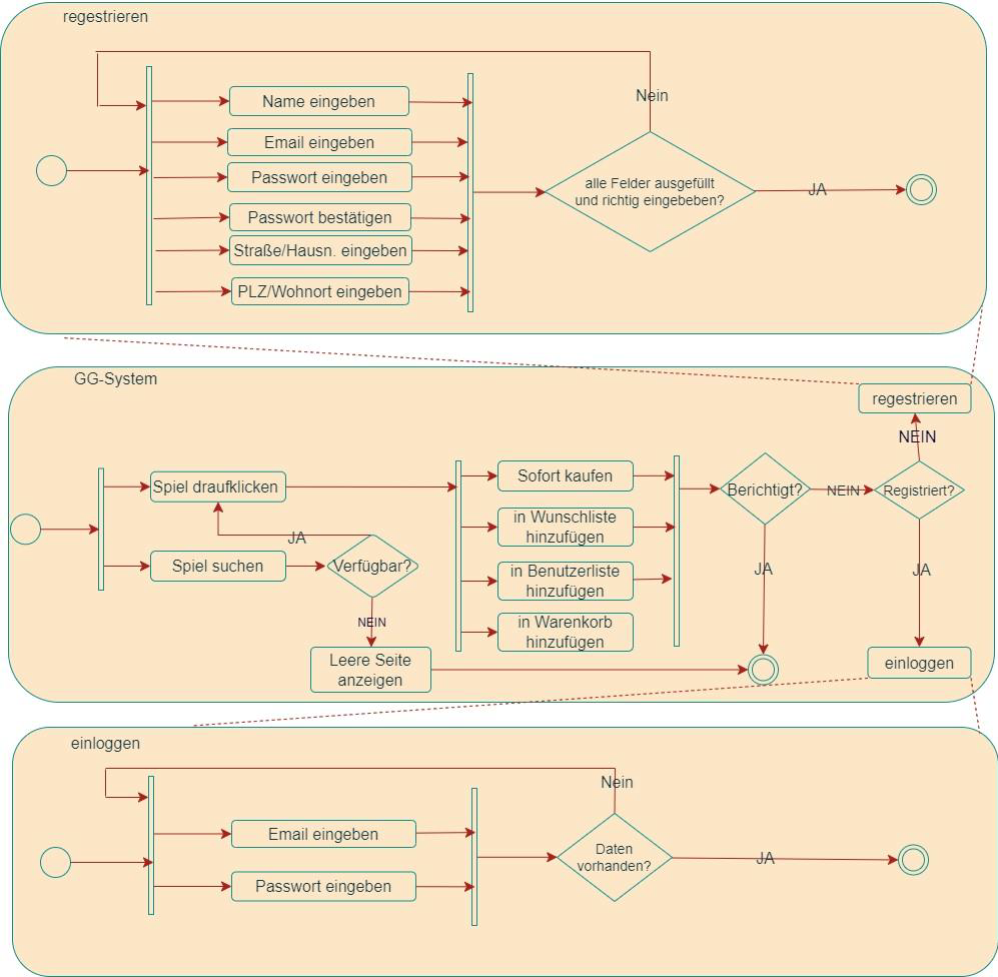
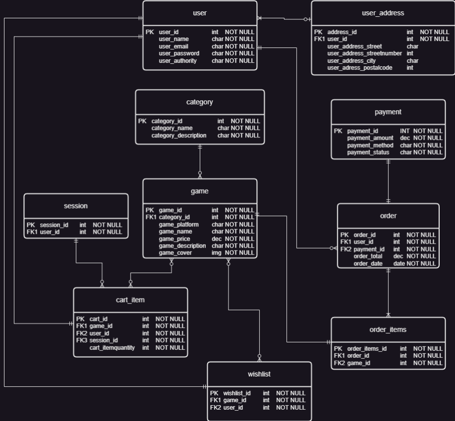

# Games Galaxy


Games Galaxy ist ein PHP-basierter Online-Shop für PC-Spiele. Das Projekt bildet typische Shop-Funktionen wie Spielekatalog, Suche, Benutzerkonto, Wunschliste, Warenkorb, Checkout und administrative Verwaltungsfunktionen ab.

## Inhaltsverzeichnis

- [Projektziel](#projektziel)
- [Aktueller Status](#aktueller-status)
- [Screenshots](#screenshots)
- [Features](#features)
- [Tech-Stack](#tech-stack)
- [Installation und lokaler Start](#installation-und-lokaler-start)
- [Nutzung](#nutzung)
- [Tests](#tests)
- [Projektstruktur](#projektstruktur)
- [Roadmap](#roadmap)
- [License](#License)

## Projektziel

Ziel des Projekts ist die Umsetzung eines strukturierten Webshops für PC-Games mit klarer Navigation, responsivem Layout und rollenbasierten Funktionen. Neben der Produktansicht stehen zentrale E-Commerce-Abläufe wie Registrierung, Login, Wunschliste, Warenkorb und Kaufabwicklung im Fokus.

## Aktueller Status

Das Projekt ist ein lauffähiger Prototyp aus einem Hochschulkontext. Die Anwendung nutzt PHP, MySQL und eine einfache MVC-Struktur. Die Datenbankstruktur und Beispielinhalte liegen als SQL-Datei im Repository.

## Screenshots

### Startseite



### Figma-Ansichten

| Desktop | Mobil |
| --- | --- |
|  |  |

### Dokumentation

| Sitemap | Flussdiagramm | ER-Modell |
| --- | --- | --- |
|  |  |  |

## Features

- Spielekatalog mit Plattformbereichen für Steam, Battle.net und Epic Games
- Detailseiten für einzelne Spiele
- Suche nach Spielen
- Registrierung und Login
- Profilbearbeitung
- Wunschliste
- Warenkorb und Checkout
- Kaufverlauf
- Admin-Funktionen für Benutzer- und Spieleverwaltung
- Kontakt-, FAQ-, Impressums- und Dokumentationsseiten
- Responsives Layout mit Desktop- und Mobilnavigation

## Tech-Stack

- **Frontend:** HTML, CSS, JavaScript
- **Backend:** PHP 8.x
- **Datenbank:** MySQL 8.x
- **Webserver:** Apache, zum Beispiel über XAMPP
- **Architektur:** MVC-orientierte Projektstruktur

## Installation und lokaler Start

### Voraussetzungen

- PHP 8.x
- MySQL 8.x oder MariaDB
- Apache mit aktiviertem `mod_rewrite`
- Lokale Entwicklungsumgebung wie XAMPP, MAMP oder eine vergleichbare PHP/MySQL-Installation

### Einrichtung

1. Repository in das lokale Webserver-Verzeichnis legen.

   Beispiel für XAMPP unter Windows:

   ```powershell
   C:\xampp\htdocs\dwp_ws2324_rkt
   ```

2. Datenbank importieren.

   ```sql
   SOURCE gamesgalaxy/GG_DBMS.sql;
   ```

   Alternativ kann die Datei `gamesgalaxy/GG_DBMS.sql` über phpMyAdmin importiert werden.

3. Datenbankverbindung prüfen.

   Die Verbindung ist in `gamesgalaxy/lib/DatabaseConnection.php` definiert und nutzt lokal standardmäßig:

   ```text
   Host: localhost
   Datenbank: gg_dbms
   Benutzer: root
   Passwort: leer
   ```

4. Anwendung im Browser öffnen.

   ```text
   http://localhost/dwp_ws2324_rkt/gamesgalaxy/Startseite/Show
   ```

## Nutzung

Die Anwendung wird über die Navigation bedient. Besucher können Spiele durchsuchen und Detailseiten ansehen. Registrierte Benutzer können zusätzlich Wunschliste, Warenkorb, Checkout und Kaufverlauf nutzen. Benutzer mit erweiterten Rechten erhalten Zugriff auf Verwaltungsfunktionen für Spiele und Benutzer.

## Tests

Automatisierte Tests sind aktuell nicht eingerichtet. Die wichtigsten Funktionen sollten nach Änderungen manuell geprüft werden:

- Startseite und Navigation
- Registrierung und Login
- Suche und Spielefilter
- Wunschliste
- Warenkorb und Checkout
- Admin-Funktionen
- Responsives Verhalten auf Desktop und Mobilgeräten

## Projektstruktur

```text
.
├── docs/
│   └── screenshots/
├── gamesgalaxy/
│   ├── controller/
│   ├── images/
│   ├── js/
│   ├── lib/
│   ├── model/
│   ├── static/
│   ├── view/
│   ├── GG_DBMS.sql
│   └── index.php
├── .htaccess
└── README.md
```

## License

Copyright (c) 2026 Mohammad Taiba. All rights reserved.

This project is published for portfolio and review purposes only. See [LICENSE](./LICENSE).
